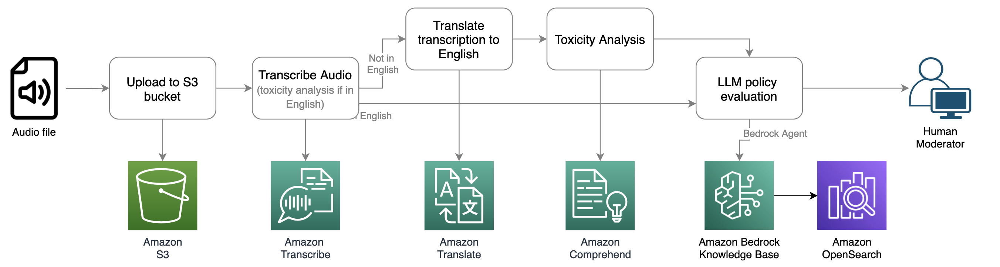
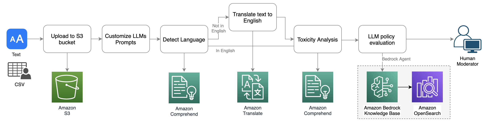

# Audio and text moderation using Amazon Transcribe, Comprehend, Translate and Bedrock

This repository contains two sample demos showcasing audio and text moderation using AWS AI services and Generative AI. Each demo includes a sandbox page that allows you to upload an audio or text file to initiate the analysis. After uploading, you can review the analysis results in the 'Sample' tab and explore the architecture design in the 'Workflow' tab.

### Audio moderation workflow


### Text moderation workflow


## Prerequisites
- You'll require an IAM role or user with access to AWS services including S3, Transcribe, Comprehend, Translate, and Bedrock.
- In Amazon Bedrock, make sure you have access to the LLMs. Refer to [this instruction](https://catalog.workshops.aws/building-with-amazon-bedrock/en-US/prerequisites/bedrock-setup) for detail.
- This demo leverages Amazon Bedrock Knowledge Base as a managed-RAG for policy evaluation with LLMs. To run the demo, create a Knowledge Base in the AWS Console and upload your trust and safety policies. Then, set the environment varaible `BEDROCK_KNOWLEDGE_BASE_ID` value with the Knowledge Base ID you've generated. To set up Bedrock Knowledge Base, refer to [this instruction](https://aws.amazon.com/blogs/aws/knowledge-bases-now-delivers-fully-managed-rag-experience-in-amazon-bedrock/).

## Start the app
### Clone source code to your local drive
```
If you've received a zip file, unzip it and navigate to the extracted folder.
```
### Create Python Virtual Environment
```
python3 -m venv .venv
source .venv/bin/activate
```
### Install dependencies
```
pip install -r requirements.txt
```
### Setup authentication
Configure the below environment variables:
```
set $AWS_REGION=AWS_REGION
set $AWS_BUCKET_NAME=YOUR_S3_BUCKET_NAME
set $AWS_S3_PREFIX=YOUR_S3_PREFIX
set $BEDROCK_KNOWLEDGE_BASE_ID=YOUR_KNOWLEDGE_BASE_ID
```
### Start the streamlit app
```
streamlit run app.py